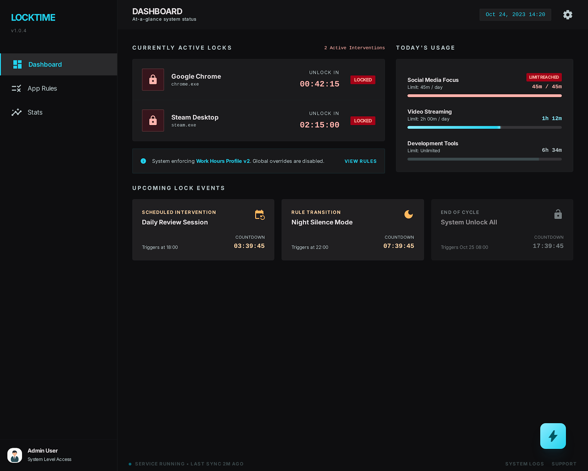
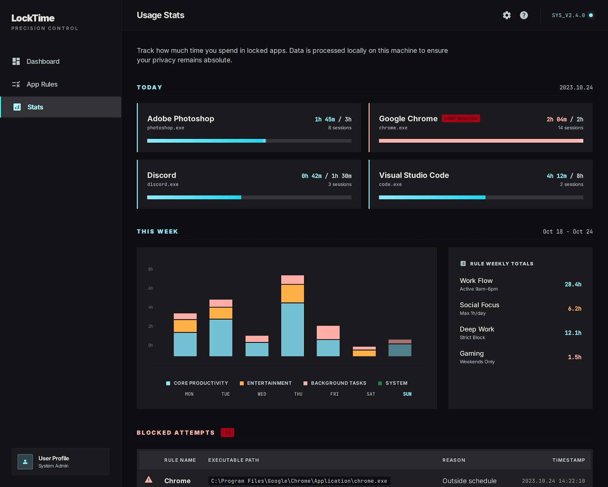

# 🔒 windows-app-locktime

> Stop yourself from opening League of Legends at 2 AM. Or any app, really.

A lightweight Windows utility that locks or time-limits any application on a schedule — powered by a Go background service and a clean web dashboard.


<!-- TODO: Add actual screenshot after first run -->

---

## ✨ Features

- **Time window locking** — block an app between specific hours (e.g. no League from 11 PM to 8 AM)
- **Daily time limits** — allow up to N minutes per day, then it's locked for the rest of the day
- **Both modes combined** — time window AND daily limit on the same app
- **Warning before lock** — get notified X minutes before the lock kicks in
- **Real-time dashboard** — see what's locked, how much time you've used, when you can play next
- **Usage stats** — daily and weekly charts so you can see your habits
- **System tray friendly** — runs as a Windows Service in the background, starts on boot
- **Anti-bypass** — uses Windows IFEO (Image File Execution Options) so renaming the exe doesn't help

---

## 📸 Screenshots

| Dashboard | Rules | Stats |
|-----------|-------|-------|
|  |  |  |
<!-- TODO: Replace placeholders with actual screenshots -->

---

## 🏗️ Architecture

```
windows-app-locktime/
├── backend/                    # Go backend (Windows Service + REST API)
│   ├── cmd/
│   │   ├── locktime-svc/      # Main service binary
│   │   └── blocker/           # IFEO interceptor stub
│   └── internal/
│       ├── api/               # HTTP handlers (gin)
│       ├── db/                # SQLite schema + queries
│       ├── engine/            # Rule evaluation + time window logic
│       ├── watcher/           # Process monitoring
│       └── service/           # Windows Service wiring
└── frontend/                  # React/Vite web dashboard
    └── src/
        ├── pages/             # Dashboard, Rules, Stats
        ├── components/        # UI components
        ├── api/               # Typed API client
        └── lib/               # schedule-convert, utils
```

**How it works:**

1. `locktime-svc.exe` runs as a Windows Service (SYSTEM privileges)
2. It registers `blocker.exe` as the IFEO "debugger" for locked apps
3. When you try to launch a locked app, Windows runs `blocker.exe` instead
4. `blocker.exe` checks the service → shows a block message or lets it through
5. A process watcher also polls every second as a fallback (catches already-running processes)
6. The web dashboard at `localhost:8089` lets you manage everything

---

## 🚀 Getting Started

### Prerequisites

- Windows 10/11 (64-bit)
- Administrator privileges (required for service install + registry writes)
- Go 1.22+ (for building from source)
- Node.js 18+ (for building frontend from source)

### Download (Recommended)

Download the latest installer from [Releases](https://github.com/lambertse/windows-app-locktime/releases).

1. Download `locktime-installer.exe`
2. Run as Administrator
3. The service installs and starts automatically
4. Your browser will open `http://localhost:8089` — the dashboard is ready

### Build from Source

**1. Clone the repo**
```bash
git clone https://github.com/lambertse/windows-app-locktime.git
cd windows-app-locktime
```

**2. Build the frontend**
```bash
cd frontend
npm install
npm run build
# Output: frontend/dist/
```

**3. Build the backend (cross-compile from any OS)**
```bash
cd backend
make build-windows
# Output: bin/locktime-svc.exe, bin/blocker.exe
```

Or on Windows directly:
```bash
cd backend
go build -o bin/locktime-svc.exe ./cmd/locktime-svc
go build -o bin/blocker.exe ./cmd/blocker
```

**4. Install the service (run as Administrator)**
```powershell
# Install and start the service
.\bin\locktime-svc.exe --install

# Open the dashboard
start http://localhost:8089
```

---

## 🖥️ Usage

### Open the Dashboard

Once the service is running, open your browser and go to:
```
http://localhost:8089
```

### Add Your First Rule

1. Click **"Add Rule"** in the sidebar
2. **Step 1 — Pick the app:** Select from running processes or browse to the `.exe` file
3. **Step 2 — Set the limit:**
   - **Time window:** choose which hours the app is blocked, and which days
   - **Daily limit:** set max minutes per day
   - **Both:** combine them
4. Save — the rule is active immediately, no restart needed

### Manage the Service

```powershell
# Install + start
.\locktime-svc.exe --install

# Uninstall
.\locktime-svc.exe --uninstall

# Run in foreground (dev/debug)
.\locktime-svc.exe --run
```

---

## 🛠️ Development

### Run backend locally (Linux/Mac)

The backend compiles and runs on Linux/Mac for development — Windows-specific features (IFEO, native file picker, process termination) are stubbed out automatically via build tags.

```bash
cd backend
go run ./cmd/locktime-svc --run
# API available at http://localhost:8089
```

### Run frontend dev server

```bash
cd frontend
npm run dev
# Dev server at http://localhost:5173
# API calls proxied to http://127.0.0.1:8089
```

### Run tests

```bash
cd backend
go test ./...

# With coverage
make test-cover
```

---

## ⚙️ Configuration

Rules and config are stored in a SQLite database at:
```
C:\ProgramData\locktime\locktime.db
```

The database is managed entirely through the web dashboard — no manual editing needed.

---

## 🔐 Security Notes

- The service runs as `SYSTEM` — this is required to write IFEO registry keys and terminate processes owned by any user
- The API only accepts connections from `127.0.0.1` — it is not accessible from other machines on the network
- IFEO keys are written to `HKLM\SOFTWARE\Microsoft\Windows NT\CurrentVersion\Image File Execution Options\<exe>`
- Config directory (`C:\ProgramData\locktime\`) is ACL'd to admin-only write access
- NTP is checked on startup — if your system clock is off by more than 5 minutes, the service enforces the most restrictive state

---

## 🗺️ Roadmap

- [x] Time window locking (v1)
- [x] Daily time limits (v1)
- [x] Web dashboard (v1)
- [x] Usage stats (v1)
- [ ] PIN override — unlock temporarily with a password (v2)
- [ ] System tray icon (v2)
- [x] Pre-built NSIS installer (v2)
- [ ] Notification toasts before lock kicks in (v2)
- [ ] Multiple profiles (work mode / weekend mode) (v3)

---

## 🤝 Contributing

PRs welcome. Please open an issue first for anything significant.

---

## 📄 License

MIT — see [LICENSE](LICENSE)
